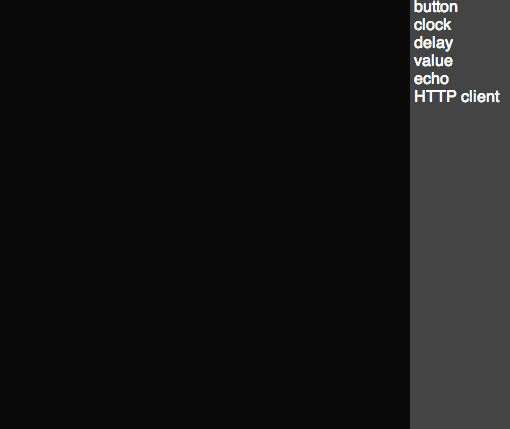

AutoGraph
=========

[](https://travis-ci.org/jbeuckm/AutoGraph)

A browser-based visual data routing automation tool.



### Try it out ###

```
npm install autograph
cd AutoGraph
npm install
```

Start a local http proxy and webserver and open in a browser:
```
grunt launch
```

Stop the proxy and server:
```
grunt kill
```

### Tests ###

open `tests/testRunner.html` in a browser to run tests.
